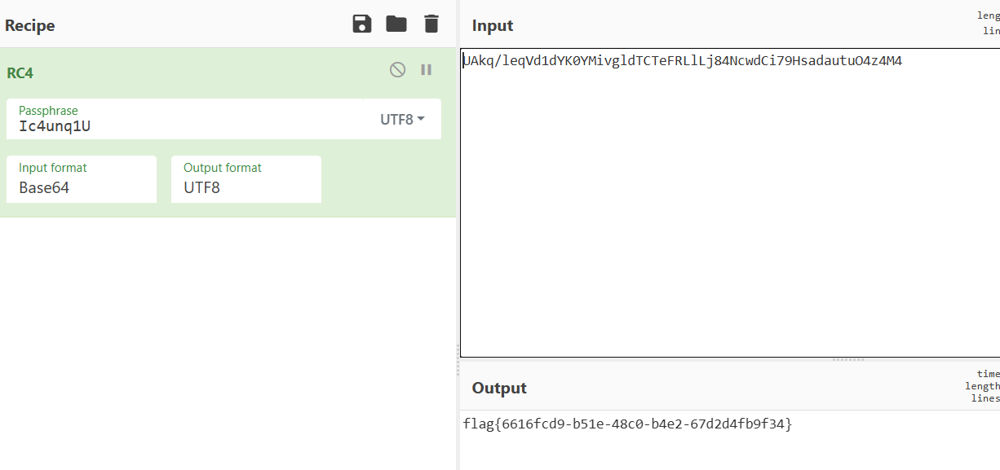

给了一堆OAEP-x-xxxxxx.pem这些是加密的RSA私钥文件，用openssl解密。密码是xxxxxx

写个脚本把所有加密的私钥文件解密

```py
import os
import subprocess

# 定义输入和输出文件夹
input_dir = "key"
output_dir = "decrypted_keys"

# 创建输出文件夹（如果不存在）
os.makedirs(output_dir, exist_ok=True)

# 遍历 key 文件夹中的所有 OAEP-x-xxxxxx.pem 文件
for filename in os.listdir(input_dir):
    if filename.startswith("OAEP-") and filename.endswith(".pem"):
        # 提取文件名中的密码部分（假设密码是文件名中最后一个 - 后的部分）
        pass_phrase = filename.split("-")[-1].split(".")[0]
        
        # 定义输入和输出文件路径
        input_file = os.path.join(input_dir, filename)
        output_file = os.path.join(output_dir, f"{filename[:-4]}_decrypted.pem")
        
        # 使用 openssl 解密
        try:
            subprocess.run(
                [
                    "openssl", "rsa",
                    "-in", input_file,
                    "-out", output_file,
                    "-passin", f"pass:{pass_phrase}",
                ],
                check=True,
            )
            print(f"Decrypted key successfully written to {output_file}")
        except subprocess.CalledProcessError as e:
            print(f"Failed to decrypt {filename}: {e}")
```

然后解密所有数据库中Type,Name,Password,Remark字段

```py
from Crypto.PublicKey import RSA
from Crypto.Util.number import *
from Crypto.Cipher import PKCS1_OAEP
from tqdm import *
import os
import sqlite3
import base64

# 定义文件夹路径
database_dir = "database"
decrypted_keys_dir = "decrypted_keys"

# 遍历 database 文件夹中的所有 .db 文件
for db_file in tqdm(os.listdir(database_dir)):
    if db_file.endswith(".db"):
        # 提取文件名中的编号（如 database-0.db 中的 0）
        db_id = db_file.split("-")[1].split(".")[0]
        
        # 构建对应的私钥文件路径
        key_file = os.path.join(decrypted_keys_dir, f"database-{db_id}_password.pem")
        
        # 检查私钥文件是否存在
        if not os.path.exists(key_file):
            print(f"私钥文件 {key_file} 不存在，跳过 {db_file}")
            continue
        
        # 加载私钥
        try:
            private_key = RSA.import_key(open(key_file).read())
            print(f"成功加载私钥文件：{key_file}")
        except Exception as e:
            print(f"加载私钥文件 {key_file} 失败: {e}")
            continue
        
        # 连接到数据库
        db_path = os.path.join(database_dir, db_file)
        try:
            conn = sqlite3.connect(db_path)
            cursor = conn.cursor()
            print(f"成功连接到数据库：{db_path}")
        except sqlite3.Error as e:
            print(f"连接数据库 {db_path} 失败: {e}")
            continue
        
        # 获取数据库中的所有表名
        try:
            cursor.execute("SELECT name FROM sqlite_master WHERE type='table';")
            tables = cursor.fetchall()
            print(f"数据库 {db_path} 中的表：{tables}")
        except sqlite3.Error as e:
            print(f"获取表名失败: {e}")
            conn.close()
            continue
        
        # 遍历每个表
        for table in tables:
            table_name = table[0]
            print(f"处理表：{table_name}")
            
            # 获取表中的所有字段
            try:
                cursor.execute(f"PRAGMA table_info({table_name});")
                columns = cursor.fetchall()
                column_names = [column[1] for column in columns]
                print(f"表 {table_name} 的字段：{column_names}")
            except sqlite3.Error as e:
                print(f"获取表 {table_name} 的字段失败: {e}")
                continue
            
            # 初始化字段列表
            type_list = []
            name_list = []
            password_list = []
            remark_list = []
            
            # 读取表中的所有数据
            try:
                cursor.execute(f"SELECT * FROM {table_name};")
                rows = cursor.fetchall()
            except sqlite3.Error as e:
                print(f"读取表 {table_name} 的数据失败: {e}")
                continue
            
            # 遍历每一行数据
            for row in rows:
                # 将每个字段的值添加到对应的列表中
                if "Type" in column_names:
                    type_index = column_names.index("Type")
                    type_list.append(row[type_index])
                
                if "Name" in column_names:
                    name_index = column_names.index("Name")
                    name_list.append(row[name_index])
                
                if "Password" in column_names:
                    password_index = column_names.index("Password")
                    password_list.append(row[password_index])
                
                if "Remark" in column_names:
                    remark_index = column_names.index("Remark")
                    remark_list.append(row[remark_index])
            
            rsakey = PKCS1_OAEP.new(private_key)
            f1 = open('decrypted_type.txt','a')
            for c in type_list:
                cipher = base64.b64decode(c)
                plain = rsakey.decrypt(cipher)
                f1.write(str(plain.decode())+'\n')
            f2 = open('decrypted_name.txt','a')
            for c in name_list:
                cipher = base64.b64decode(c)
                plain = rsakey.decrypt(cipher)
                f2.write(str(plain.decode())+'\n')  
            f3 = open('decrypted_password.txt','a')
            for c in password_list:
                cipher = base64.b64decode(c)
                plain = rsakey.decrypt(cipher)
                f3.write(str(plain.decode())+'\n')     # 关闭数据库连接
            f4 = open('decrypted_remark.txt','a')
            for c in remark_list:
                cipher = base64.b64decode(c)
                plain = rsakey.decrypt(cipher)
                f4.write(str(plain.decode())+'\n')
        conn.close()
```

后面以这个形式把数据存放到一个文件中

```
Admin : SoFyE9EiFiNk : jnwy;f|9n.|n/mar : a28E
```

```py
from Crypto.PublicKey import RSA
from Crypto.Util.number import *
from Crypto.Cipher import PKCS1_OAEP
from tqdm import *
import os
import sqlite3
import base64

# 定义文件夹路径
database_dir = "database"
decrypted_keys_dir = "decrypted_keys"

# 遍历 database 文件夹中的所有 .db 文件
for db_file in tqdm(os.listdir(database_dir)):
    if db_file.endswith(".db"):
        # 提取文件名中的编号（如 database-0.db 中的 0）
        db_id = db_file.split("-")[1].split(".")[0]
        
        # 构建对应的私钥文件路径
        key_file = os.path.join(decrypted_keys_dir, f"database-{db_id}_password.pem")
        
        # 检查私钥文件是否存在
        if not os.path.exists(key_file):
            print(f"私钥文件 {key_file} 不存在，跳过 {db_file}")
            continue
        
        # 加载私钥
        try:
            private_key = RSA.import_key(open(key_file).read())
            print(f"成功加载私钥文件：{key_file}")
        except Exception as e:
            print(f"加载私钥文件 {key_file} 失败: {e}")
            continue
        
        # 连接到数据库
        db_path = os.path.join(database_dir, db_file)
        try:
            conn = sqlite3.connect(db_path)
            cursor = conn.cursor()
            print(f"成功连接到数据库：{db_path}")
        except sqlite3.Error as e:
            print(f"连接数据库 {db_path} 失败: {e}")
            continue
        
        # 获取数据库中的所有表名
        try:
            cursor.execute("SELECT name FROM sqlite_master WHERE type='table';")
            tables = cursor.fetchall()
            print(f"数据库 {db_path} 中的表：{tables}")
        except sqlite3.Error as e:
            print(f"获取表名失败: {e}")
            conn.close()
            continue
        
        # 遍历每个表
        for table in tables:
            table_name = table[0]
            print(f"处理表：{table_name}")
            
            # 获取表中的所有字段
            try:
                cursor.execute(f"PRAGMA table_info({table_name});")
                columns = cursor.fetchall()
                column_names = [column[1] for column in columns]
                print(f"表 {table_name} 的字段：{column_names}")
            except sqlite3.Error as e:
                print(f"获取表 {table_name} 的字段失败: {e}")
                continue
            
            # 初始化字段列表
            type_list = []
            name_list = []
            password_list = []
            remark_list = []
            
            # 读取表中的所有数据
            try:
                cursor.execute(f"SELECT * FROM {table_name};")
                rows = cursor.fetchall()
            except sqlite3.Error as e:
                print(f"读取表 {table_name} 的数据失败: {e}")
                continue
            
            # 遍历每一行数据
            for row in rows:
                # 将每个字段的值添加到对应的列表中
                if "Type" in column_names:
                    type_index = column_names.index("Type")
                    type_list.append(row[type_index])
                
                if "Name" in column_names:
                    name_index = column_names.index("Name")
                    name_list.append(row[name_index])
                
                if "Password" in column_names:
                    password_index = column_names.index("Password")
                    password_list.append(row[password_index])
                
                if "Remark" in column_names:
                    remark_index = column_names.index("Remark")
                    remark_list.append(row[remark_index])
            
            rsakey = PKCS1_OAEP.new(private_key)
            f1 = open('decrypted_msg.txt','a')
            for i in range(len(type_list)):
                enc_type = base64.b64decode(type_list[i])
                dec_type = rsakey.decrypt(enc_type)
                enc_name = base64.b64decode(name_list[i])
                dec_name = rsakey.decrypt(enc_name)
                enc_password = base64.b64decode(password_list[i])
                dec_password = rsakey.decrypt(enc_password)
                enc_remark = base64.b64decode(remark_list[i])
                dec_remark = rsakey.decrypt(enc_remark)
                msg = dec_type.decode() + ' : ' + dec_name.decode() + ' : ' + dec_password.decode() + ' : ' + dec_remark.decode()
                f1.write(msg + '\n')                   
        conn.close()
```

发现结果中有type为enc和key的，手动提取出来

```yaml
Enc : VKeuFEfF4oqH : r=,4C~XzRje}`BIh : UAkq
Enc : 9Y0LHRuwa6YL : uM|\hx!7<:'X9[W6 : /leq
Enc : yqV0efhJjLeL : `PvP!J<".y~peVwL : Vd1d
Enc : 9p5cCTD1zLKI : U(0?hp+-V:AZuw : YK0Y
Enc : Yu7pVVESOO8p : m_Uca]e.yb&)Qr]U : Mivg
Enc : 573xHdBdN74J : ,?]dYhi<m>\>(qte : ldTC
Enc : Z2OjruLUXAjG : F6Opdijs"Fh)Q5Q2 : TeFR
Enc : 6DKgMLOFlOas : 6ye_ghqzC^9CEa6Y : LlLj
Enc : roaYqNWQzu09 : b`I(M=@nn'NoixSY : 84Nc
Enc : 2QXOQKSjD1pf : !;V_'YWW7JaBqNFk : wdCi
Enc : ZXK56fQT4gWk : uJ{Ik0MjiXLOYVB5 : 79Hs
Enc : dS6KGJfqhmCt : p(]cmCXI3.|Z(7jZ : adau
Enc : VOJbFsh9VMz0 : dVd}Ujz_f+:k2+6n : tuO4
Enc : eNkZzZKOCm5y : GzWJR#U.w9)Kd}a1 : z4M4
```

还有两行key

```yaml
Key : yulqvSZRDJGQ : 7]q5[0PXsj4kCO2F : Ic4u
Key : XYm0XvlT5ett : ZHA4-E5G":8M+?yv : nq1U
```

最后得到

```yaml
key：Ic4unq1U
enc：UAkq/leqVd1dYK0YMivgldTCTeFRLlLj84NcwdCi79HsadautuO4z4M4
```



