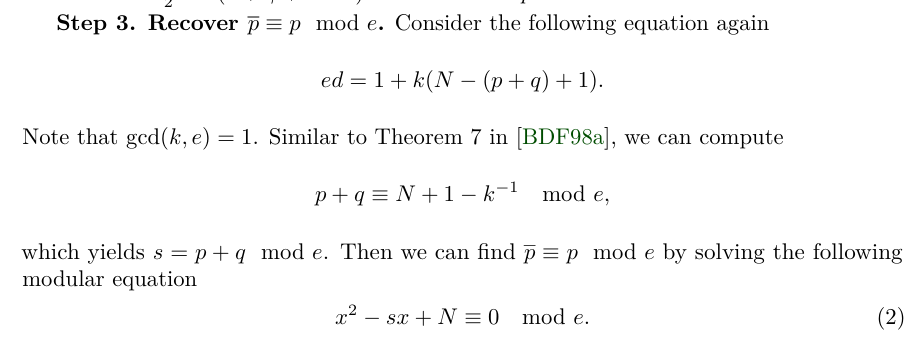
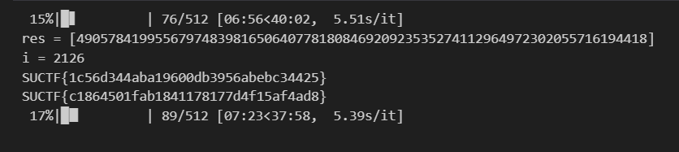

根据`k = (e*d_m) // n + 1`计算准确的k，根据[这篇论文中的3-1部分](https://cic.iacr.org/p/1/3/29/pdf)进行攻击。但问题是在计算p的高位时，一位都对不上。

于是我仅仅用了以下这个步骤求出`p % e`




有256bit，然后可以用已知p低位恢复p的思路进行恢复。自己测试的时候发现在这种情况下，e如果是270bit(相当于有p的低270bit)，可以用copper直接恢复，所以我用上多线程爆破14bit

> exp

```py
from tqdm import trange
from Crypto.Util.number import inverse
from multiprocessing import Pool
from hashlib import sha256
import gmpy2


d_m =  54846367460362174332079522877510670032871200032162046677317492493462931044216323394426650814743565762481796045534803612751698364585822047676578654787832771646295054609274740117061370718708622855577527177104905114099420613343527343145928755498638387667064228376160623881856439218281811203793522182599504560128
n =  102371500687797342407596664857291734254917985018214775746292433509077140372871717687125679767929573899320192533126974567980143105445007878861163511159294802350697707435107548927953839625147773016776671583898492755338444338394630801056367836711191009369960379855825277626760709076218114602209903833128735441623
e =  112238903025225752449505695131644979150784442753977451850362059850426421356123

# 计算 k
k = (e*d_m) // n + 1

# 计算p mod e的值
k_inv = inverse(k,e)
s = (n + 1 + k_inv) % e
R.<x> = PolynomialRing(Zmod(e))
f = x^2 - s*x + n
res = f.roots()
may_p_mod_e = [int(res[0][0]),int(res[1][0])]

def attack(range):
    low = range[0]
    up = range[1]
    for pl in may_p_mod_e:
        R.<x> = PolynomialRing(Zmod(n))
        for i in trange(low,up):
            f = (x * 2^14 + i) * e + pl
            res = f.monic().small_roots(X=2^242,beta=0.49,epsilon=0.02)
            if res != []:
                print(f"res = {res}")
                print(f"i = {i}")
            for root in res:
                p = (int(root) * 2^14 + i) * e + pl
                if n % p == 0:
                    flag1 = "SUCTF{" + sha256(str(p).encode()).hexdigest()[:32] + "}"
                    flag2 = "SUCTF{" + sha256(str(n // p).encode()).hexdigest()[:32] + "}"
                    print(flag1)
                    print(flag2)
                    return 
                
ranges = [(i,i + 512) for i in range(0,2^14,512)]

with Pool(32) as pool:  
    r = list(pool.imap(attack,ranges))
```



