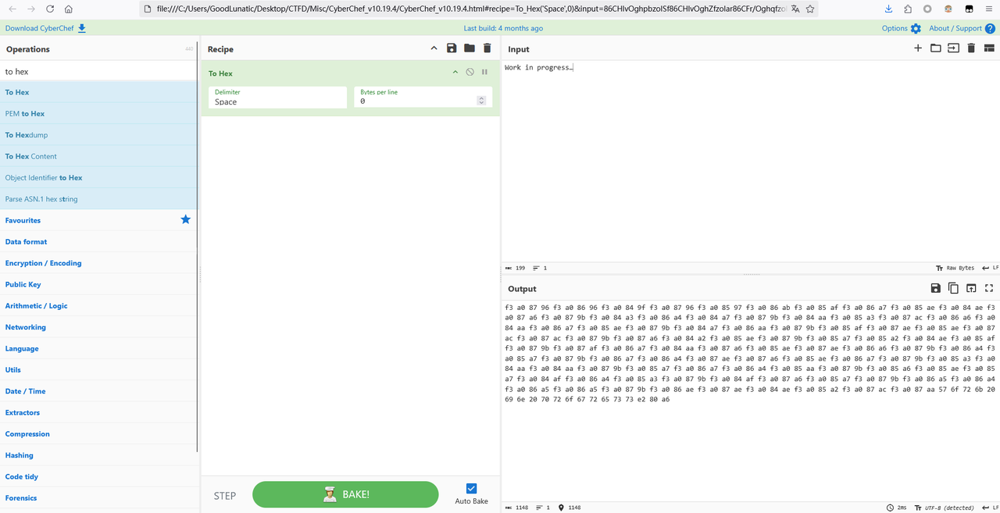
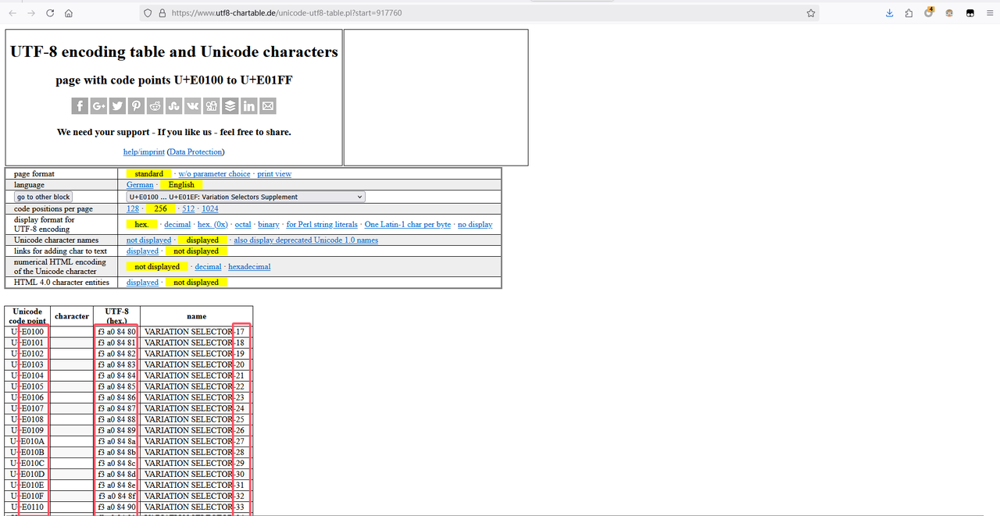
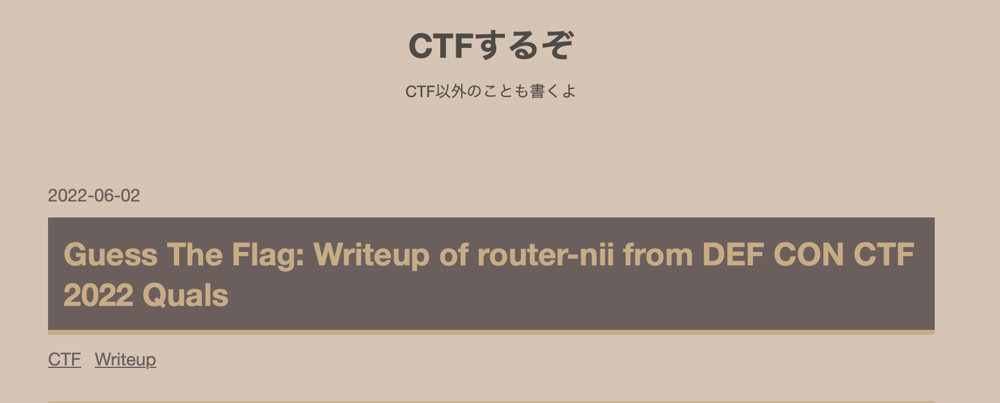

直接复制题面信息，放到CyberChef中To Hex可以看到隐藏的信息



参考链接：

https://www.utf8-chartable.de/unicode-utf8-table.pl?start=917760

在上面参考链接中找到了类似的四字节十六进制值，猜测与本题有关系

用以下代码将四字节的十六进制值转为`VARIATION SELECTOR-`后的十进制值



```py
# hex_data = "f3a08480"
hex_data = "f3a08796f3a08696f3a0849ff3a08796f3a08597f3a086abf3a085aff3a086a7f3a085aef3a084aef3a087a6f3a0879bf3a084a3f3a086a4f3a084a7f3a0879bf3a084aaf3a085a3f3a087acf3a086a6f3a084aaf3a086a7f3a085aef3a0879bf3a084a7f3a086aaf3a0879bf3a085aff3a087aef3a085aef3a087acf3a087acf3a0879bf3a087a6f3a084a2f3a085aef3a0879bf3a085a7f3a085a2f3a084aef3a085aff3a0879bf3a087aff3a086a7f3a084aaf3a087a6f3a085aef3a087aef3a086a6f3a0879bf3a086a4f3a085a7f3a0879bf3a086a7f3a086a4f3a087aef3a087a6f3a085aef3a086a7f3a0879bf3a085a3f3a084aaf3a084aaf3a0879bf3a085a7f3a086a7f3a086a4f3a085aaf3a0879bf3a085a6f3a085aef3a085a7f3a084aff3a086a4f3a085a3f3a0879bf3a084aff3a087a6f3a085a7f3a0879bf3a086a5f3a086a4f3a086a5f3a086a5f3a0879bf3a086aef3a087aef3a084aef3a085a2f3a087acf3a087aa"

data = bytes.fromhex(hex_data)
res = data.decode()
dic = {}
for item in res:
    tmp = ord(item)-0xe0100+17
    print(tmp, end=" ")
    if tmp not in dic:
        dic[tmp] = 1
    else:
        dic[tmp] += 1
print(dic)
```

转换后可以得到如下内容

```
231 167 48 231 104 188 128 184 127 63 247 236 52 181 56 236 59 116 253 183 59 184 127 236 56 187 236 128 255 127 253 253 236 247 51 127 236 120 115 63 128 236 256 184 59 247 127 255 183 236 181 120 236 184 181 255 247 127 184 236 116 59 59 236 120 184 181 123 236 119 127 120 64 181 116 236 64 247 120 236 182 181 182 182 236 191 255 63 115 253 251
```

除去flag格式对应的密文，映射成字母

```python
data = '231 167 48 231 104 188 128 184 127 63 247 236 52 181 56 236 59 116 253 183 59 184 127 236 56 187 236 128 255 127 253 253 236 247 51 127 236 120 115 63 128 236 256 184 59 247 127 255 183 236 181 120 236 184 181 255 247 127 184 236 116 59 59 236 120 184 181 123 236 119 127 120 64 181 116 236 64 247 120 236 182 181 182 182 236 191 255 63 115 253 251'

data = [int(i) for i in data.split(' ')][6:-1]
print(data)
dict1 = {}
cs = data
# 构建字典
for i in cs:
    if i not in dict1:
        dict1[i] = chr(len(dict1) + ord('a'))
print(dict1)

# 映射
tmp = ''
for i in cs:
    tmp += dict1[i]
print(tmp.replace(dict1[236], ' '))  # 下划线断句
```

单表替换，放到quipquip里，得到`great job inspire by guess the flag writeup of router nii from cefkon ktf dodd quals`


前面明显有意义，但后面没解出来，检索发现题目原型




文章题目符合格式，故可确定为``great job inspire by guess the flag writeup of router nii from defcon ctf 2022 quals``

通过密文格式（其实上叙文章里也提到了），能确认flag里的内容应该是小写，且flag里的`o`都该改成`0`，提交后不对。

于是尝试其他CTF数字代换（leet），`s`换成`5`时得解

```python
data = '231 167 48 231 104 188 128 184 127 63 247 236 52 181 56 236 59 116 253 183 59 184 127 236 56 187 236 128 255 127 253 253 236 247 51 127 236 120 115 63 128 236 256 184 59 247 127 255 183 236 181 120 236 184 181 255 247 127 184 236 116 59 59 236 120 184 181 123 236 119 127 120 64 181 116 236 64 247 120 236 182 181 182 182 236 191 255 63 115 253 251'

data = [int(i) for i in data.split(' ')][6:-1]

dict1 = {}
cs = data
# 构建字典
for i in cs:
    if i not in dict1:
        dict1[i] = chr(len(dict1) + ord('a'))


# 映射
tmp = ''
for i in cs:
    tmp += dict1[i]
print(tmp.replace(dict1[236], ' '))  # 下划线断句

a = "TPCTF{great_job_inspire_by_guess_the_flag_writeup_of_router_nii_from_defcon_ctf_2022_quals}"
a = a.replace('o', '0')
a = a.replace('s', '5')
assert  len(set([i for i in a])) == 30

print(a)   # TPCTF{great_j0b_in5pire_by_gue55_the_flag_writeup_0f_r0uter_nii_fr0m_defc0n_ctf_2022_qual5}
```
